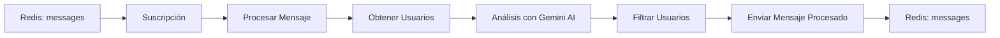

# Taller MS Processor

## Descripción

El microservicio `taller_ms_processor` es un componente central del sistema de licitaciones que se encarga de procesar mensajes de contratos de licitación y determinar qué usuarios deben recibir notificaciones basándose en sus intereses y el contenido del mensaje.

## Funcionalidad Principal

### ¿Qué hace?

1. **Procesamiento de Mensajes**: Recibe mensajes de licitaciones en estado "pre-processed" desde Redis
2. **Análisis de Contenido**: Utiliza Google Gemini AI para analizar si el contenido del mensaje coincide con los intereses de los usuarios
3. **Filtrado de Usuarios**: Determina qué usuarios deben recibir el mensaje basándose en el análisis de IA
4. **Envío de Resultados**: Reenvía el mensaje procesado con la lista de emails de destinatarios

### ¿Cómo funciona?

1. **Suscripción a Redis**: El servicio se suscribe al canal "messages" de Redis para recibir mensajes
2. **Obtención de Usuarios**: Consulta la API de Django para obtener la lista de usuarios con sus intereses
3. **Procesamiento con IA**: Para cada usuario, utiliza Google Gemini para determinar si el contenido del mensaje coincide con sus intereses
4. **Filtrado**: Solo incluye en la lista de emails a los usuarios cuyo análisis de IA devuelve "true"
5. **Reenvío**: Envía el mensaje procesado de vuelta a Redis con el estado "processed"

## Arquitectura

### Tecnologías Utilizadas

- **Node.js** con **TypeScript**
- **Redis** para comunicación entre microservicios
- **Google Gemini AI** para análisis de contenido
- **Axios** para comunicación HTTP con la API de Django
- **Jest** para testing

### Patrón de Diseño

El servicio utiliza un patrón de **Clean Architecture** con separación clara de responsabilidades:

- **Domain**: Modelos de datos y lógica de negocio
- **Application**: Casos de uso y servicios de aplicación
- **Interface**: Adaptadores para comunicación externa

## Estructura de Directorios

```
taller_ms_processor/
├── src/
│   ├── app/                          # Capa de aplicación - Casos de uso
│   │   ├── get-clients/             # Obtención de clientes desde Django API
│   │   │   ├── entities.ts          # Entidades del servicio
│   │   │   ├── index.ts             # Punto de entrada del módulo
│   │   │   ├── service.ts           # Lógica de obtención de clientes con cache
│   │   │   └── __tests__/           # Tests del módulo get-clients
│   │   │       ├── service.test.ts  # Tests unitarios del servicio
│   │   │       ├── integration.test.ts # Tests de integración
│   │   │       └── entities.test.ts # Tests de entidades
│   │   └── process-message/         # Procesamiento principal de mensajes
│   │       ├── entities.ts          # Entidades del servicio
│   │       ├── functions.ts         # Funciones auxiliares (construcción de prompts)
│   │       ├── index.ts             # Punto de entrada del módulo
│   │       ├── service.ts           # Lógica de procesamiento con Google Gemini
│   │       └── __tests__/           # Tests del módulo process-message
│   │           ├── service.test.ts  # Tests unitarios del servicio
│   │           ├── integration.test.ts # Tests de integración
│   │           └── functions.test.ts # Tests de funciones auxiliares
│   ├── configs.ts                   # Configuración centralizada
│   ├── domain/                      # Capa de dominio - Modelos de datos
│   │   ├── message-model.ts         # Interfaz del mensaje de licitación
│   │   ├── clients.ts               # Tipo de cliente
│   │   └── users.ts                 # Tipo de usuario
│   ├── interface/                   # Capa de interfaz - Adaptadores
│   │   ├── process-message.ts       # Adaptador para procesamiento de mensajes
│   │   ├── send-message.ts          # Adaptador para envío de mensajes
│   │   └── suscribe.ts              # Adaptador para suscripción a Redis
│   └── index.ts                     # Punto de entrada principal
├── package.json                     # Dependencias y scripts
├── tsconfig.json                    # Configuración de TypeScript
└── Dockerfile                       # Configuración de contenedor
```

### Explicación de Directorios

#### `/src/app/`
Contiene la lógica de aplicación organizada por casos de uso:

- **`get-users/`**: Maneja la obtención de usuarios desde la API de Django con sistema de cache para optimizar rendimiento
- **`process-message/`**: Contiene la lógica principal de procesamiento de mensajes usando Google Gemini AI

#### `/src/domain/`
Define los modelos de datos y tipos del dominio:

- **`message-model.ts`**: Define la estructura del mensaje de licitación
- **`users.ts`**: Define el tipo de usuario con sus intereses

#### `/src/interface/`
Adaptadores para comunicación externa:

- **`suscribe.ts`**: Maneja la suscripción a Redis para recibir mensajes
- **`process-message.ts`**: Orquesta el procesamiento de mensajes recibidos
- **`send-message.ts`**: Maneja el envío de mensajes procesados de vuelta a Redis

#### `/src/configs.ts`
Configuración centralizada del servicio incluyendo:
- Configuración de Redis
- API Key de Google Gemini
- URL de la API de Django
- Tiempo de refresh de usuarios

## Flujo de Datos



## Variables de Entorno

```bash
GOOGLE_API_KEY=your_google_api_key
REDIS_HOST=localhost
REDIS_PORT=6379
```

## Comandos

```bash
# Desarrollo
npm run dev

# Build
npm run build

# Tests
npm test

# Linting
npm run lint
npm run lint:fix

# Pre-commit (ejecuta lint y tests)
npm run pre-commit
```

## Pre-commit Hook

El proyecto incluye un pre-commit hook configurado con **Husky** y **lint-staged** que ejecuta automáticamente:

1. **ESLint**: Análisis de código y corrección automática de errores de formato
2. **Tests**: Ejecución de tests relacionados con los archivos modificados

### Configuración

- **Husky**: Maneja los git hooks
- **lint-staged**: Ejecuta linter y tests solo en archivos staged
- **ESLint**: Configurado para TypeScript con reglas específicas del proyecto

### Instalación

```bash
# Instalar dependencias
npm install

# Configurar Husky (se ejecuta automáticamente con npm install)
npm run prepare
```

El hook se ejecutará automáticamente en cada commit, asegurando que el código cumpla con los estándares de calidad.

## Modelo de Mensaje

```typescript
interface Message {
  id: string;
  status: "pre-processed" | "processed" | "discarded";
  createdAt: Date;
  payload: {
    id: string;
    title: string;
    description: string;
  };
  emails: string[];
}
```

## Ejemplo de Uso

```json
{
  "id": "1",
  "status": "pre-processed",
  "createdAt": "2021-01-01",
  "payload": {
    "id": "lic-001",
    "title": "Construcción de puente",
    "description": "Proyecto de construcción de puente en la región norte"
  },
  "emails": []
}
```

Después del procesamiento, el mensaje se actualiza con los emails de los usuarios cuyos intereses coinciden con el contenido del mensaje.
